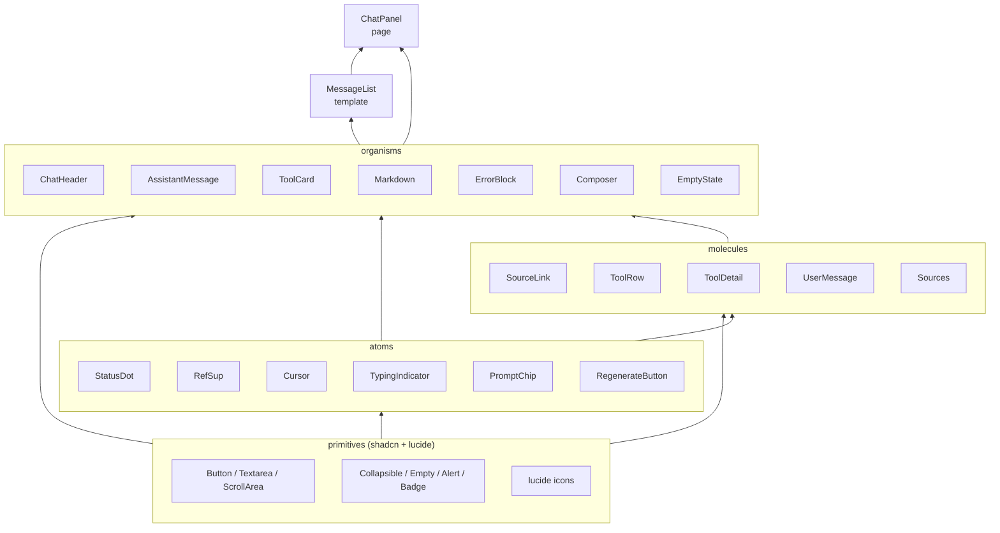
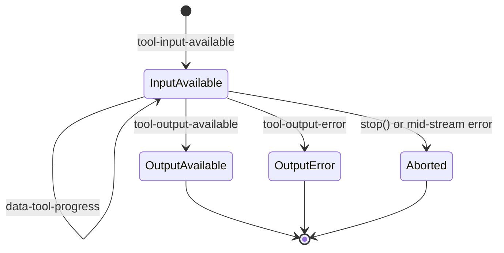

# Frontend Streaming Chat Architecture

This document records the architecture of the streaming chat UI (`frontend/src/components/pages/ChatPanel.tsx` and its dependencies). It captures decisions that are not obvious from the code: the atomic layering rule, where streaming state lives, and the AI SDK v6 behaviors the implementation relies on.

## 1. Scope

- Renders the SSE wire format emitted by `backend/api/routers/chat.py` (`start`, `text-delta`, `tool-input-available`, `tool-output-available`, `tool-output-error`, `data-tool-progress`, `error`, `finish`).
- Consumes the stream via `@ai-sdk/react` `useChat` + `DefaultChatTransport` from `ai`.
- Owns the full chat lifecycle in a single page component (`ChatPanel`); everything below is stateless or owns only local UI concerns.

## 2. Atomic 6-Layer Component Tree

| Layer | Classification rule | Examples |
|---|---|---|
| **primitives** | External/unmodified components. Two physical homes: `components/primitives/` (shadcn) and `node_modules/lucide-react`. **Do not hand-edit shadcn files** — they are overwritten by `pnpm dlx shadcn@latest add`. | `Button`, `Textarea`, `ScrollArea`, `Collapsible`, `Empty`, `Alert`, `Badge`, `AlertCircle`, `RefreshCw` |
| **atoms** | Leaf component OR trivial primitive wrapper (primitive + 1–2 inline elements, no structural layout). | `StatusDot`, `RefSup`, `Cursor`, `TypingIndicator`, `PromptChip`, `RegenerateButton` |
| **molecules** | Structural composition (multiple rows/columns/sections or ≥3 distinct children). Still `(props) => JSX` — no state/hooks/business logic. | `SourceLink`, `ToolRow`, `ToolDetail`, `UserMessage`, `Sources` |
| **organisms** | Uses `useState` / hooks, or is domain-aware (walks `UIMessage.parts`, reads `ToolUIPart.state`, etc.). | `AssistantMessage`, `ToolCard`, `Markdown`, `ErrorBlock`, `Composer`, `EmptyState`, `ChatHeader` |
| **templates** | Layout shell that accepts data via props; does not wire `useChat`. | `MessageList` |
| **pages** | Top-level orchestrator — the only layer that wires `useChat` and owns the chat lifecycle. | `ChatPanel` |

**Extension rule** — inline a new visual element at first use; extract to `atoms/` only on the second occurrence. Do not introduce `features/` or `hooks/` subfolders under `components/`; hooks live in `frontend/src/hooks/`.

## 3. State Ownership

Streaming lifecycle state lives in `ChatPanel` only. Atoms and molecules never import from `@ai-sdk/react`. Organisms accept `status` / `messages` as props but do not subscribe to chat state themselves.

| State | Owner | Responsibility |
|---|---|---|
| `messages`, `status`, `error`, `sendMessage`, `regenerate`, `stop`, `id` | `useChat` hook | AI SDK manages SSE lifecycle, message reconciliation, tool part state. |
| `chatId` | `ChatPanel` `useState<ChatId>` | Initialized with `crypto.randomUUID()`. `"Clear conversation"` sets a new UUID, passed as the `id` prop to `useChat`, which triggers an internal reset. |
| `toolProgress: Record<ToolCallId, string>` | `useToolProgress` hook | Subscribes to `useChat.onData`; writes transient `data-tool-progress` messages into a record. Cleared explicitly by `ChatPanel` on session reset. |
| `abortedTools: Set<ToolCallId>` | `ChatPanel` | Frontend-only marker for the 4th tool state (§5). Added on `stop()` or mid-stream `error` when tool is still `input-available`. Cleared on session reset or when the same turn is regenerated. |
| `lastTriggerRef` | `ChatPanel` `useRef` | Remembers the most recent `sendMessage` / `regenerate` metadata so `handleRetry` can dispatch correctly (§6). |
| `shouldFollowBottom` | `useFollowBottom` hook | MessageList scroll tracking with a 100px threshold; force-overrides on new user message. |

**Why `ChatPanel` owns `chatId` even though `useChat` has an `id` field**: `useChat.id` is read-only — there is no `setId`. To implement session reset we need to change the `id` prop from outside. Letting `useChat` auto-generate the id would forfeit reset control.

## 4. SSE Wire Format → UI Mapping

The backend emits AI SDK v6 `uiMessageChunkSchema`-compatible chunks. The frontend interprets them as follows:

| Backend SSE event | AI SDK `ToolUIPart.state` | UI render |
|---|---|---|
| `tool-input-available` | `input-available` | 🟠 StatusDot running + `toolProgress[id]` or `Calling {toolName}...` |
| `data-tool-progress` (transient sidecar) | — | `toolProgress[id] = message`; re-renders the running ToolCard. Never enters `messages`. |
| `tool-output-available` | `output-available` | 🟢 StatusDot success + generic label `Completed` + expandable INPUT/OUTPUT JSON |
| `tool-output-error` | `output-error` | 🔴 StatusDot error + friendly translated title (via `lib/error-messages.ts`) + expandable raw detail |
| `text-start` / `text-delta` / `text-end` | text part | Markdown incremental re-render + trailing `Cursor` while streaming |
| `error` | — (stream-level) | `useChat.error` set; `status → 'error'`. Does **not** append an `error` part to `messages` (see §7). |
| `finish` | — | `status → 'ready'` |
| _(no SSE — frontend-only)_ | `aborted` | ⚫ StatusDot gray + label `Aborted` + expandable INPUT |

## 5. Tool Card State Machine

`aborted` is a frontend-only 4th state — AI SDK's `ToolUIPart.state` enum has only three values (`input-available`, `output-available`, `output-error`). Entering `aborted` is triggered by `useChat.stop()` or a mid-stream `error` event while a tool is still `input-available`. Without this, a stopped tool would keep its pulsing dot and falsely imply "still running". `ChatPanel` tracks which tool call IDs are aborted via `abortedTools: Set<ToolCallId>`; `AssistantMessage` overrides the visual to `aborted` when dispatching parts.

## 6. Smart Retry Routing

`handleRetry` dispatches by the shape of `messages` at the time of retry:

| Situation | Action |
|---|---|
| Last message is `user` (pre-stream error, nothing streamed) | `sendMessage(originalUserText)` |
| Last message is `assistant` with partial parts (mid-stream error) | `regenerate({ messageId: lastAssistantMessage.id })` |
| Any pre-stream **4xx** on a regenerate attempt (race window) | Fall back to `sendMessage(originalUserText)` to avoid a 4xx loop on a stale `messageId` |

**No manual `messageId` stash is needed**. AI SDK v6 writes `start.messageId` directly into `state.message.id`, so `regenerate({ messageId: lastAssistantMessage.id })` already carries the backend-issued `lc_run--...` ID. Verified in `ai@6.0.142` (`node_modules/ai/dist/index.js`, chat store reducer) and against the live backend (V-1 probe).

## 7. AI SDK v6 Contract Findings

These behaviors are not documented in AI SDK release notes. They were verified against `@ai-sdk/react@3.0.144` + `ai@6.0.142` and the S1 backend during pre-coding contract probes (V-1/V-2/V-3) and the code review loop. Record them so a future reader does not re-derive them from SDK internals.

### 7.1 SSE `error` chunks do **not** persist into `message.parts[]`

AI SDK v6's chat store reducer (`case "error"`) only calls `onError` and sets `status` to `"error"`. It does not push an `error`-typed part into the message. Consequences:

- `UIMessage.parts` never contains an item with `type === "error"`.
- Any `useEffect` that expects to fire on `parts.some(p => p.type === 'error')` will never run.
- The correct signal for stream-level errors is `status === 'error'` combined with the top-level `error` field from `useChat`.

The mid-stream ErrorBlock therefore renders at the **`ChatPanel` level** (reading `useChat.error`), not inline inside `AssistantMessage`.

### 7.2 `useChat.stop()` is clean — it does not pollute `error`

Calling `stop()` during streaming:
- transitions `status` back to `'ready'`
- leaves `error` as `undefined` (not `null`, not an `AbortError`)

No `try/catch` wrapper, no `AbortError` filter, and no manual `setStatus` is required inside `handleStop`.

Two implementation notes that surfaced from V-3:
- The SDK's `error` field is typed `Error | undefined`. Use `.toBeUndefined()` in tests, not `.toBeNull()`.
- MSW handlers for stream fixtures **must** listen to `request.signal.abort` and close the server-side stream when the client aborts. Otherwise the SDK waits for end-of-stream that never comes, producing false-negative abort tests.

### 7.3 S1 accepts `regenerate` on a partial turn (HTTP 200)

When the client disconnects mid-stream, LangGraph has already persisted the partial AIMessage to its checkpointer. `POST /api/v1/chat` with `trigger: regenerate-message` and the partial `messageId` returns HTTP 200 and a fresh SSE stream (new `messageId`, tool calls re-issued).

The race window: if the client disconnects before LangGraph commits any AIMessage, the backend falls back to an earlier turn or raises "No assistant message to regenerate" (HTTP 404). This is why `handleRetry` must fall back to `sendMessage` on any pre-stream 4xx — not just 422.

### 7.4 SSE text-delta field name is `delta`, not `textDelta`

The v6 `UIMessageChunk` type uses `delta` for incremental text. Fixtures that write `textDelta` are silently dropped by the SDK (the chunk fails schema validation), producing a stream that looks valid to the test runner but is actually empty. The backend serializer (`sse_serializer.py`) already uses `delta`; frontend fixtures must match.

### 7.5 AI SDK v6 request body is nested

The backend expects `{ id, messages: [{role, parts: [{type, text}]}], trigger, messageId? }`. Flat `{ message: string }` payloads from v5-style clients are rejected. See `StreamChatRequest` in `backend/api/routers/chat.py`.

## 8. Markdown & Sources: Defer-to-Ready

`react-markdown` does not expose unified's `file.data`, so a remark plugin cannot return `ExtractedSources` back to React. Two options were considered and rejected:

1. Run a standalone `extractSources(text)` on every `text-delta` — forces two full parses per delta and pushes `AssistantMessage` into stateful territory.
2. Patch `react-markdown` internals — not worth the maintenance burden.

The shipped strategy is **defer-to-ready**:

- While `status === 'streaming' && isLast`, skip `extractSources` entirely. Raw `[N]: url "title"` definition lines are briefly visible in the stream; `[N]` stays as literal text; no Sources block; no RefSup.
- When `status` leaves `streaming` (ready / error / stop), a `useMemo` in `AssistantMessage` runs `extractSources` exactly once. The derived text (with definition lines stripped) plus the sources array is handed to the stateless `Markdown` organism and the `Sources` molecule.

The UX is a "pop-in" at stream end, similar to ChatGPT / Claude.ai. Partial sources on error/stop are preserved because the `useMemo` also fires when the stream stops on error.

### Citation structure

`extractSources` uses `remark-parse` (the same CommonMark parser `react-markdown` uses internally) to find `definition` nodes — this eliminates the drift that a custom regex would have against CommonMark. A separate `markdownSourcesPlugin` (registered on `<ReactMarkdown>`) runs at render time to tag `linkReference` nodes with `data-citation` and resolve `href` to the source URL. The anchor override reads the attribute rather than sniffing link text, so a normal `[3](url)` whose text happens to be `3` is never mistaken for a citation.

## 9. UI String Language Policy (V1)

All frontend-controlled user-facing strings are **English**. No i18n framework in V1. Rationale:
- mixed-language chrome within a single viewport produces visual noise
- error titles map to backend HTTP status / tool names — English keeps the mapping stable
- the empty-state prompt chips are already English; mixing in Traditional Chinese for placeholder/disclaimer/clear button would conflict

Backend-provided strings are shown as-is:
- `data-tool-progress.message` (backend-language)
- Assistant text body (LLM follows the user's language)
- Tool output JSON (raw)
- Backend raw error `rawMessage` — **never rendered directly**; only surfaced inside an expandable "Show details" pane after being mapped to a friendly English title via `lib/error-messages.ts`.

## 10. Related Documents

- `frontend/src/components/README.md` — short structure map for contributors
- `frontend/src/__tests__/msw/README.md` — MSW test infrastructure and URL-gated worker
- `docs/frontend_dom_contract.md` — `data-testid` / `data-status` / `data-tool-state` contract (kept as the testing surface of record)
- `backend/api/routers/chat.py` + `backend/tests/api/test_chat.py` — backend wire format
