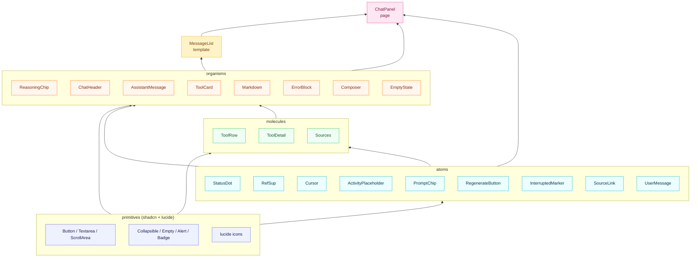
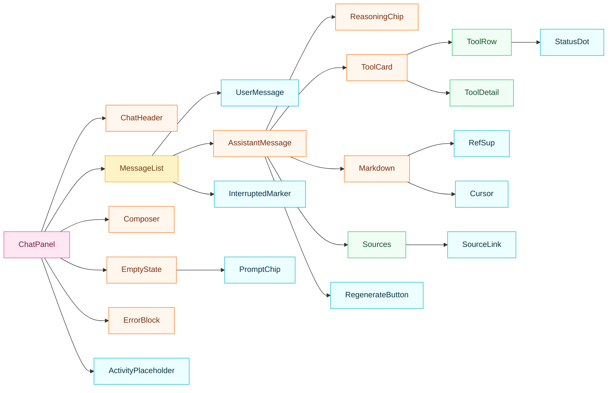
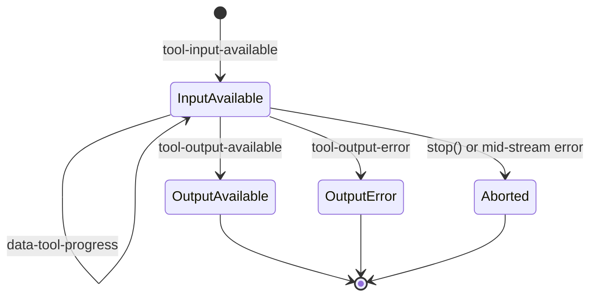
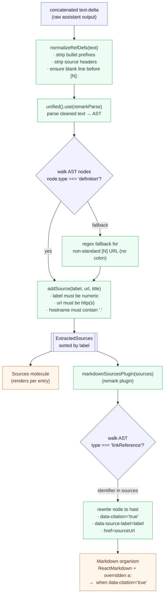

# Frontend Streaming Chat Architecture

This document records the architecture of the streaming chat UI (`frontend/src/components/pages/ChatPanel.tsx` and its dependencies). It captures decisions that are not obvious from the code: the atomic layering rule, where streaming state lives, and the AI SDK v6 behaviors the implementation relies on.

## 1. Scope

- Renders the SSE wire format emitted by `backend/api/routers/chat.py` (`start`, `text-delta`, `tool-input-available`, `tool-output-available`, `tool-output-error`, `data-tool-progress`, `data-tool-artifact`, `error`, `finish`).
- Consumes the stream via `@ai-sdk/react` `useChat` + `DefaultChatTransport` from `ai`.
- Owns the full chat lifecycle in a single page component (`ChatPanel`); everything below is stateless or owns only local UI concerns.

## 2. Atomic 6-Layer Component Tree

### 2.1 Layer rule


```mermaid
flowchart BT
    subgraph primitives["primitives (shadcn + lucide)"]
        P1[Button / Textarea / ScrollArea]
        P2[Collapsible / Empty / Alert / Badge]
        P3[lucide icons]
    end

    subgraph atoms
        StatusDot
        RefSup
        Cursor
        ActivityPlaceholder
        PromptChip
        RegenerateButton
        InterruptedMarker
        SourceLink
        UserMessage
    end

    subgraph molecules
        ToolRow
        ToolDetail
        Sources
    end

    subgraph organisms
        ReasoningChip
        ChatHeader
        AssistantMessage
        ToolCard
        Markdown
        ErrorBlock
        Composer
        EmptyState
    end

    MessageList[MessageList<br/>template]
    ChatPanel[ChatPanel<br/>page]

    primitives --> atoms
    primitives --> molecules
    primitives --> organisms
    atoms --> molecules
    atoms --> organisms
    molecules --> organisms
    organisms --> MessageList
    MessageList --> ChatPanel
    organisms --> ChatPanel
    atoms --> ChatPanel

    classDef primitiveCls fill:#eef2ff,stroke:#6366f1,color:#1e1b4b
    classDef atomCls fill:#ecfeff,stroke:#06b6d4,color:#083344
    classDef moleculeCls fill:#f0fdf4,stroke:#22c55e,color:#14532d
    classDef organismCls fill:#fff7ed,stroke:#f97316,color:#7c2d12
    classDef templateCls fill:#fef3c7,stroke:#eab308,color:#713f12
    classDef pageCls fill:#fce7f3,stroke:#ec4899,color:#831843

    class P1,P2,P3 primitiveCls
    class StatusDot,RefSup,Cursor,ActivityPlaceholder,PromptChip,RegenerateButton,InterruptedMarker,SourceLink,UserMessage atomCls
    class ToolRow,ToolDetail,Sources moleculeCls
    class ReasoningChip,ChatHeader,AssistantMessage,ToolCard,Markdown,ErrorBlock,Composer,EmptyState organismCls
    class MessageList templateCls
    class ChatPanel pageCls
```

| Layer          | Classification rule                                                                                                                                                                                               | Examples                                                                                                                                                          |
| -------------- | ------------------------------------------------------------------------------------------------------------------------------------------------------------------------------------------------------------------------------------------------------------------ | -------------------------------------------------------------------------------------------------------------------------------------------------------------- |
| **primitives** | External/unmodified components. Two physical homes: `components/primitives/` (shadcn) and `node_modules/lucide-react`. **Do not hand-edit shadcn files** — they are overwritten by `pnpm dlx shadcn@latest add`. | `Button`, `Textarea`, `ScrollArea`, `Collapsible`, `Empty`, `Alert`, `Badge`, `AlertCircle`, `RefreshCw`                                                          |
| **atoms**      | Leaf component OR trivial primitive wrapper (primitive + a fixed set of child elements, no structural composition of other project components).                                                                  | `StatusDot`, `RefSup`, `Cursor`, `ActivityPlaceholder`, `PromptChip`, `RegenerateButton`, `InterruptedMarker`, `SourceLink`, `UserMessage` |
| **molecules**  | Structural composition of atoms (multiple rows/columns/sections or ≥3 distinct children). Still `(props) => JSX` — no `useState`, no business logic.                                                             | `ToolRow`, `ToolDetail`, `Sources`                                                                                                               |
| **organisms**  | Uses `useState` / hooks, or is domain-aware (walks `UIMessage.parts`, reads `ToolUIPart.state`, etc.).                                                                                                            | `ReasoningChip`, `ChatHeader`, `AssistantMessage`, `ToolCard`, `Markdown`, `ErrorBlock`, `Composer`, `EmptyState`                                                                  |
| **templates**  | Layout shell that accepts data via props; does not wire `useChat`.                                                                                                                                               | `MessageList`                                                                                                                                                     |
| **pages**      | Top-level orchestrator — the only layer that wires `useChat` and owns the chat lifecycle.                                                                                                                         | `ChatPanel`                                                                                                                                                       |

**Extension rule** — inline a new visual element at first use; extract to `atoms/` only on the second occurrence. Do not introduce `features/` or `hooks/` subfolders under `components/`; hooks live in `frontend/src/hooks/`.

### 2.2 Concrete composition graph

The layer diagram above shows which layer _may_ depend on which. This graph shows the _actual_ compositions that ship — what each component wraps in its render tree. Use it to trace which atom change affects which organism.


```mermaid
flowchart LR
    ChatPanel --> ChatHeader
    ChatPanel --> MessageList
    ChatPanel --> Composer
    ChatPanel --> EmptyState
    ChatPanel --> ErrorBlock
    ChatPanel --> ActivityPlaceholder

    MessageList --> UserMessage
    MessageList --> AssistantMessage
    MessageList --> InterruptedMarker

    AssistantMessage --> ReasoningChip
    AssistantMessage --> ToolCard
    AssistantMessage --> Markdown
    AssistantMessage --> Sources
    AssistantMessage --> RegenerateButton

    ToolCard --> ToolRow
    ToolCard --> ToolDetail
    ToolRow --> StatusDot

    Markdown --> RefSup
    Markdown --> Cursor

    Sources --> SourceLink

    EmptyState --> PromptChip

    classDef atomCls fill:#ecfeff,stroke:#06b6d4,color:#083344
    classDef moleculeCls fill:#f0fdf4,stroke:#22c55e,color:#14532d
    classDef organismCls fill:#fff7ed,stroke:#f97316,color:#7c2d12
    classDef templateCls fill:#fef3c7,stroke:#eab308,color:#713f12
    classDef pageCls fill:#fce7f3,stroke:#ec4899,color:#831843

    class StatusDot,RefSup,Cursor,ActivityPlaceholder,PromptChip,RegenerateButton,InterruptedMarker,SourceLink,UserMessage atomCls
    class ToolRow,ToolDetail,Sources moleculeCls
    class ReasoningChip,ChatHeader,AssistantMessage,ToolCard,Markdown,ErrorBlock,Composer,EmptyState organismCls
    class MessageList templateCls
    class ChatPanel pageCls
```

Design / review history that shaped this tree is captured under `artifacts/current/` (not tracked in git — see `artifacts/current/manual-verification-issues.md` and `code-review-improvement-report.md` in the local workspace).

## 3. SSE Wire Format → UI Mapping

### Glossary: `UIMessage.parts`

AI SDK v6 models an assistant turn as a `UIMessage` whose content is an array of typed **parts**:

```ts
type UIMessage = {
  id: string;
  role: "user" | "assistant" | "system";
  parts: UIMessagePart[];
};
```

Each incoming SSE chunk is reduced into the corresponding part. The renderer simply does `message.parts.map(part => renderByType(part))`. The word `part` in this codebase (`part: ToolPart`, `parts.map((part) => ...)`) always refers to an element of `UIMessage.parts[]` — it is the SDK's own term, not a project invention.

Tool-specific parts are narrowed: `ToolCard` receives a `toolPart` prop after `AssistantMessage` has already filtered for `type === "tool-…"` or `type === "dynamic-tool"`.

### Chunk → part mapping

The backend emits AI SDK v6 `uiMessageChunkSchema`-compatible chunks. The frontend interprets them as follows:

| Backend SSE event                                       | AI SDK `ToolUIPart.state`                  | UI render                                                                                                                                                                                                                            |
| -------------------------------------------------------- | ------------------------------------------- | ---------------------------------------------------------------------------------------------------------------------------------------------------------------------------------------------------------------------------------- |
| `tool-input-available`                                  | `input-available`                          | 🟠 StatusDot running + `toolProgress[id]` or `Calling {toolName}...`                                                                                                                                                                 |
| `data-tool-progress` (transient sidecar)                | —                                          | `toolProgress[id] = message`; re-renders the running ToolCard. Never enters `messages`.                                                                                                                                              |
| `data-tool-artifact` (persistent sidecar)                | data part                                   | UI-only tool metadata (e.g. `sec_filing_search` EDGAR URL) kept out of the model context; stays in `messages` for the post-stream citation resolver, keyed by `toolCallId`.                                                        |
| `tool-output-available`                                 | `output-available`                         | 🟢 StatusDot success + generic label `Completed` + expandable INPUT/OUTPUT JSON                                                                                                                                                      |
| `tool-output-error`                                     | `output-error`                             | 🔴 StatusDot error + friendly translated title (via `lib/error-messages.ts`) + expandable raw detail                                                                                                                                 |
| `text-start` / `text-delta` / `text-end`                | text part                                  | Markdown incremental re-render + trailing `Cursor` while streaming                                                                                                                                                                   |
| `reasoning-start` / `reasoning-delta` / `reasoning-end` | reasoning part (`state: streaming → done`) | `ReasoningChip`: streaming = pinned ~4-line window with live text; `done` = collapsed `Thought for Xs`; part stuck `streaming` after abort = collapsed `Stopped — thought for Xs`. A part that closed with no delta renders nothing. |
| `error`                                                 | — (stream-level)                           | `useChat.error` set; `status → 'error'`. Does **not** append an `error` part to `messages` (see §6).                                                                                                                                 |
| `finish`                                                | —                                          | `status → 'ready'`                                                                                                                                                                                                                    |
| _(no SSE — frontend-only)_                              | `aborted`                                  | ⚫ StatusDot gray + label `Aborted` + expandable INPUT                                                                                                                                                                                |

## 4. Tool Card State Machine


```mermaid
stateDiagram-v2
    [*] --> InputAvailable: tool-input-available
    InputAvailable --> InputAvailable: data-tool-progress
    InputAvailable --> OutputAvailable: tool-output-available
    InputAvailable --> OutputError: tool-output-error
    InputAvailable --> Aborted: stop() or mid-stream error
    OutputAvailable --> [*]
    OutputError --> [*]
    Aborted --> [*]
```

`aborted` is a frontend-only 4th state — AI SDK's `ToolUIPart.state` enum has only three values (`input-available`, `output-available`, `output-error`). Entering `aborted` is triggered by `useChat.stop()` or a mid-stream `error` event while a tool is still `input-available`. Without this, a stopped tool would keep its pulsing dot and falsely imply "still running". `ChatPanel` tracks which tool call IDs are aborted via `abortedTools: Set<ToolCallId>`; `AssistantMessage` overrides the visual to `aborted` when dispatching parts. Because `abortedTools` is a click-time snapshot of `handleStop`'s render closure, it can miss a tool call that arrives inside the `experimental_throttle` window right before Stop is clicked — status is already `streaming` by then, so no further status change forces a fresh render to pick it up. `AssistantMessage`'s check is therefore `(abortedTools.has(toolCallId) || interrupted) && isRunningToolState(...)`: the turn-level `interrupted` flag (§4.1) is read fresh on every render, so it catches that tool once its still-running state does eventually render.

### 4.1 Turn-Level Interruption Record

`abortedTools` above is tool-granular and only exists while a tool card is on screen. `ChatPanel` also keeps a message-granular companion, `interruptedMessages: Set<string>` — captured unconditionally in `handleStop`, at the same point as `abortedTools`, using the id of whichever message is last when Stop is clicked. This covers what `abortedTools` cannot: a Stop during the placeholder window or on reply text with no running tool still leaves a trace.

- **Render** — `MessageList` renders the `InterruptedMarker` atom as a sibling row immediately after the `UserMessage` or `AssistantMessage` whose id is in `interruptedMessages`.
- **Gate** — `AssistantMessage` takes `interrupted` as a prop and hides `RegenerateButton` when true. The backend's checkpoint only holds a finalized `AIMessage` for a turn that ran to completion, so regenerating an interrupted turn would 422 regardless of how much answer text reached the client.
- **Lifecycle** — cleared only by `handleClearSession` (new `chatId`, fresh state). There is no per-message cleanup on regenerate: the gate above means a message id in the set never has a reachable Regenerate control to trigger one.

## 5. Smart Retry Routing

`handleRetry` dispatches by the shape of `messages` at the time of retry:

| Situation                                                         | Action                                                                                  |
| ------------------------------------------------------------------ | ----------------------------------------------------------------------------------------- |
| Last message is `user` (pre-stream error, nothing streamed)       | `sendMessage(originalUserText)`                                                         |
| Last message is `assistant` with partial parts (mid-stream error) | `regenerate({ messageId: lastAssistantMessage.id })`                                    |
| Any pre-stream **4xx** on a regenerate attempt (race window)      | Fall back to `sendMessage(originalUserText)` to avoid a 4xx loop on a stale `messageId` |

**No manual `messageId` stash is needed**. AI SDK v6 writes `start.messageId` directly into `state.message.id`, so `regenerate({ messageId: lastAssistantMessage.id })` already carries the backend-issued `lc_run--...` ID. Verified in `ai@6.0.142` (`node_modules/ai/dist/index.js`, chat store reducer) and against the live backend (see `scripts/v1-partial-regen-probe.sh`).

## 6. AI SDK v6 Contract Findings

The non-obvious behaviors of `@ai-sdk/react@3.0.144` + `ai@6.0.142` — SSE error routing, `stop()` semantics, partial-turn regenerate, wire format quirks — are documented in a dedicated reference: [`ai_sdk_v6_contract_findings.md`](./ai_sdk_v6_contract_findings.md).

## 7. Markdown & Sources: Extract-on-Finish

`react-markdown` does not expose unified's `file.data`, so a remark plugin cannot return `ExtractedSources` back to React. Two options were considered and rejected:

1. Run a standalone `extractSources(text)` on every `text-delta` — forces two full parses per delta and pushes `AssistantMessage` into stateful territory.
2. Patch `react-markdown` internals — not worth the maintenance burden.

The shipped strategy is **extract-on-finish**:

- While `status === 'streaming' && isLast`, skip `extractSources` entirely — no Sources block; no RefSup; `[N]` stays as literal text. Definition lines (`[N]: url "title"`) are stripped from the displayed text unconditionally, streaming or not (see `AssistantMessage`'s `displayText` memo), so they are never visible at any point — only the Sources block / RefSup resolution is what's deferred until the turn completes.
- When `status` leaves `streaming` (ready / error / stop), a `useMemo` in `AssistantMessage` runs `extractSources` exactly once. The derived text (with definition lines stripped) plus the sources array is handed to the stateless `Markdown` organism and the `Sources` molecule.

The UX is a "pop-in" at stream end, similar to ChatGPT / Claude.ai. Partial sources on error/stop are preserved because the `useMemo` also fires when the stream stops on error.

### 7.1 Parse flow — raw text to Sources block and RefSup


```mermaid
flowchart TD
    rawText["concatenated text-delta<br/>(raw assistant output)"]

    rawText --> normalize["normalizeRefDefs(text)<br/>· strip bullet prefixes<br/>· strip source headers<br/>· ensure blank line before [N]:"]

    normalize --> parser["unified().use(remarkParse)<br/>parse cleaned text → AST"]

    parser --> defVisit{"walk AST nodes<br/>node.type === 'definition'?"}

    defVisit -->|yes| addSource["addSource(label, url, title)<br/>· label must be numeric<br/>· url must be http(s)<br/>· hostname must contain '.'"]

    defVisit -->|fallback| regex["regex fallback for<br/>non-standard [N] URL (no colon)"]

    regex --> addSource

    addSource --> sources[["ExtractedSources<br/>sorted by label"]]

    sources --> sourcesBlock["Sources molecule<br/>(renders <SourceLink> per entry)"]

    sources --> plugin["markdownSourcesPlugin(sources)<br/>(remark plugin)"]

    plugin --> linkRef{"walk AST<br/>type === 'linkReference'?"}

    linkRef -->|identifier in sources| tag["rewrite node to hast <a><br/>· data-citation='true'<br/>· data-source-label=label<br/>· href=sourceUrl"]

    tag --> markdown["Markdown organism<br/>ReactMarkdown + overridden a:<br/>→ <RefSup/> when data-citation='true'"]

    classDef transformCls fill:#f0fdf4,stroke:#22c55e,color:#14532d
    classDef dataCls fill:#eef2ff,stroke:#6366f1,color:#1e1b4b
    classDef uiCls fill:#fff7ed,stroke:#f97316,color:#7c2d12

    class normalize,parser,addSource,plugin,tag,regex transformCls
    class rawText,sources,defVisit,linkRef dataCls
    class sourcesBlock,markdown uiCls
```

### 7.2 Citation structure

`extractSources` uses `remark-parse` (the same CommonMark parser `react-markdown` uses internally) to find `definition` nodes — this eliminates the drift that a custom regex would have against CommonMark. A separate `markdownSourcesPlugin` (registered on `<ReactMarkdown>`) runs at render time to tag `linkReference` nodes with `data-citation` and resolve `href` to the source URL. The anchor override in `Markdown.tsx` reads that attribute rather than sniffing link text, so a normal `[3](url)` whose text happens to be `3` is never mistaken for a citation.

### 7.3 Streaming Block Memoization & Throttle

Two independent mechanisms keep a long streaming answer from stuttering. `ChatPanel` passes `experimental_throttle: STREAM_THROTTLE_MS` (`frontend/src/lib/timing.ts`) to `useChat`, coalescing the SDK's message-state updates to roughly 20Hz instead of re-rendering on every wire delta. Independently, `Markdown` (`frontend/src/components/organisms/Markdown.tsx`) splits the accumulated text into top-level blocks via `remark-parse` while `isStreaming` is true and renders each block through a child memoized on its content, so a delta only re-runs `ReactMarkdown`'s full parse → mdast → hast → React pipeline for the block still being written — settled blocks are skipped. Once the turn completes, `Markdown` switches back to a single whole-document parse rather than continuing to render per block, because citation resolution (§7.1–7.2 above) needs the complete document: a `[1]` reference and its `[1]: url` definition can land in different blocks, and CommonMark only pairs them within one parse.

## 8. Related Documents

- [`ai_sdk_v6_contract_findings.md`](./ai_sdk_v6_contract_findings.md) — SDK behaviors and wire-format quirks
- `frontend/src/components/README.md` — short structure map for contributors
- `frontend/src/__tests__/msw/README.md` — MSW test infrastructure and URL-gated worker
- `docs/frontend_dom_contract.md` — `data-testid` / `data-status` / `data-tool-state` principles and the `data-error-class` enum (testing surface of record)
- `backend/api/routers/chat.py` + `backend/tests/api/test_chat.py` — backend wire format
- `scripts/v1-partial-regen-probe.sh` — S1 partial-turn regenerate probe (see §6 findings)
